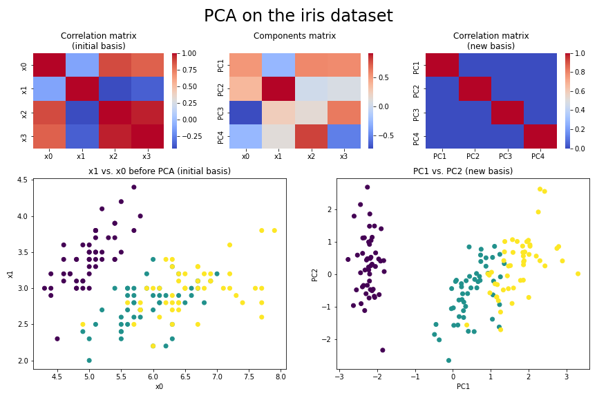

# Hi there 👋
## About me
After a first career in scientific research (🧬💊🧠) and teaching (👨‍🎓👷‍♀️👨‍⚕️), 
i'm currently involved in [teaching](https://www.lewagon.com/data-science-course/full-time) `data science` 
and working on projects (own and freelance). 
I'm thrilled by the latest development of `Deep Learning` 
and passionate about learning, designing tools and automating tasks.

## Sample projects
### 🚒 AntiFakeScience
Final student project at Le Wagon, partnering with fact-checking organization [ScienceFeedback](https://sciencefeedback.co). In a team of 4, we designed a web app aimed at screening contents that match the claims from a database. We used MPNET transformer embedding, web scraping and GCP.

[link to repos (private access)](https://github.com/antifakescience) | [link to demo app](http://antifakescience.herokuapp.com/) | [link to demo slideshow (in French)](https://docs.google.com/presentation/d/1ebWiQwunrS-YNUi-8BIkRfkMZBjW9CD2oQK_mX6O304/edit?usp=sharing) | [link to demo video (in French)](https://www.youtube.com/embed/iL4D2hWe05o?start=3435)
### 🚲 [MaStationVelib](http://velib.edmz.fr/)
*Vélib'* is a popular bike-rental service in Greater Paris. For several months, I've collected the state of 1300+ docking points (*stations*) with a 5-minute time interval. Project aims at:
- handling a dataset with tens of millions entries
- sharing this dataset through an API
- displaying (webapp) a summary for your favorite docking-station
- reporting the insights from a global analysis (*in progress*)
- implementing ML models to predict the state of a docking point (*not quite done yet*)

[link to webapp](http://velib.edmz.fr/) | [link to API](https://velib-v1-hi7so7se7a-ew.a.run.app/docs) | [link to repo-back](https://github.com/E-Dmz/MaStationVelib) | [link to repo-front](https://github.com/E-Dmz/MaStationVelib-front) | [link to repo-explore](https://github.com/E-Dmz/VelibExplore) | 

[link a related project: VelibAndCats](https://github.com/E-Dmz/VelibAndCats)

***I'm using my own NAS server (Synology DS720+) on a CRON task for data sourcing, pandas and matplotlib for dataviz, streamlit, Heroku for front-end and fastapi, Docker, GCP for back-end.***

### 📉 DisplayCovidData
SantéPubliqueFrance is a government agency that releases Covid data on a daily basis. This project aims at visualizing this data in a somewhat original way. 

An early version of this project included fully-automated daily fetching, plotting and publishing on Twitter. 

I am currently refactoring and api-ing.

I am using cron tasks, api query, pandas/matplotlib and twitter API
## 📒 Gists
- [Neural Networks](http://placeholder.edmz.fr)
- [DataViz](http://placeholder.edmz.fr)

[PCA demo](https://gist.github.com/E-Dmz/d43c972ba0c51571c70dcb78dcaba79e)|[UMAP animate demo](http://placeholder.edmz.fr)
-|-
|
<!--
  - 📈 #dataviz suite:
    * 

  - 🐦 #twitterapi suite:
    * 
    * 
    * 
    * 
  
  - 💡 #miscellaneous:
    * 

<!--
**E-Dmz/E-Dmz** is a ✨ _special_ ✨ repository because its `README.md` (this file) appears on your GitHub profile.
I want to train as a data scientist because i think AI is going to reshape our world, for better and for worse  ·  ·  ·  ·  ·  ·  ·  ·  ·  ·  ·  ·  ·  ·  ·  ·  ·  ·  ·  ·  ·  ·  ·  ·  ·  ·  ·  ·  ·  ·  ·  ·  ·  ·  ·  ·  ·  ·  ·  ·  ·  ·  ·  ·  ·  ·  ·  ·  ·  ·  ·  ·  ·  ·  ·  I'm also passionate about 💡🔧🧮 and 🙋‍♀️🙋‍♂️🚀  
🧬💊🧠 = "biochemistry, pharmacology and neuroscience"   ·  ·  ·  ·  ·  ·  ·  ·  ·  ·  ·  ·  ·  ·  ·  ·  ·  ·  ·  ·  ·  ·  ·  ·  ·  ·  ·  ·  ·  ·  ·  ·  ·  ·  ·  ·  ·  ·  ·  ·  ·  ·  ·  ·  ·  ·  ·  ·  ·  ·
👨‍🎓👷‍♀️👨‍⚕️ =  "high school students, water treatment technicians and radiology technicians"   ·  ·  ·  ·  ·  ·  ·  ·  ·  ·  ·  ·  ·  ·  ·  ·  ·  ·  ·  ·  ·  ·  ·  ·  ·  ·  ·  ·  ·  ·  ·  ·  ·  ·  ·  ·  ·  ·  ·  ·  ·  ·  ·  ·  ·  ·  ·  ·  ·  ·
💡🔧🧮 = "learning, designing new tools, automating tasks"   ·  ·  ·  ·  ·  ·  ·  ·  ·  ·  ·  ·  ·  ·  ·  ·  ·  ·  ·  ·  ·  ·  ·  ·  ·  ·  ·  ·  ·  ·  ·  ·  ·  ·  ·  ·  ·  ·  ·  ·  ·  ·  ·  ·  ·  ·  ·  ·  ·  ·
🙋‍🙋‍♂️🚀 = "collaborating on impactful projects"

Hi! I'm 37. I spent 10 years studying biology and doing research in biochemistry/pharmacology/neuroscience. I spent another 10 years teaching science and techniques to high-school students, water treatment technicians and radiology technicians. I'm training as a data scientist because i think AI is going to reshape our world, for better and for worse. I'm also passionate about learning, designing tools and automating tasks. After the bootcamp, i'd like to collaborate on meaningful and impactful projects.

Here are some ideas to get you started:

- 🔭 I’m currently working on ...
- 🌱 I’m currently learning ...
- 👯 I’m looking to collaborate on ...
- 🤔 I’m looking for help with ...
- 💬 Ask me about ...
- 📫 How to reach me: ...
- 😄 Pronouns: ...
- ⚡ Fun fact: ...
-->
